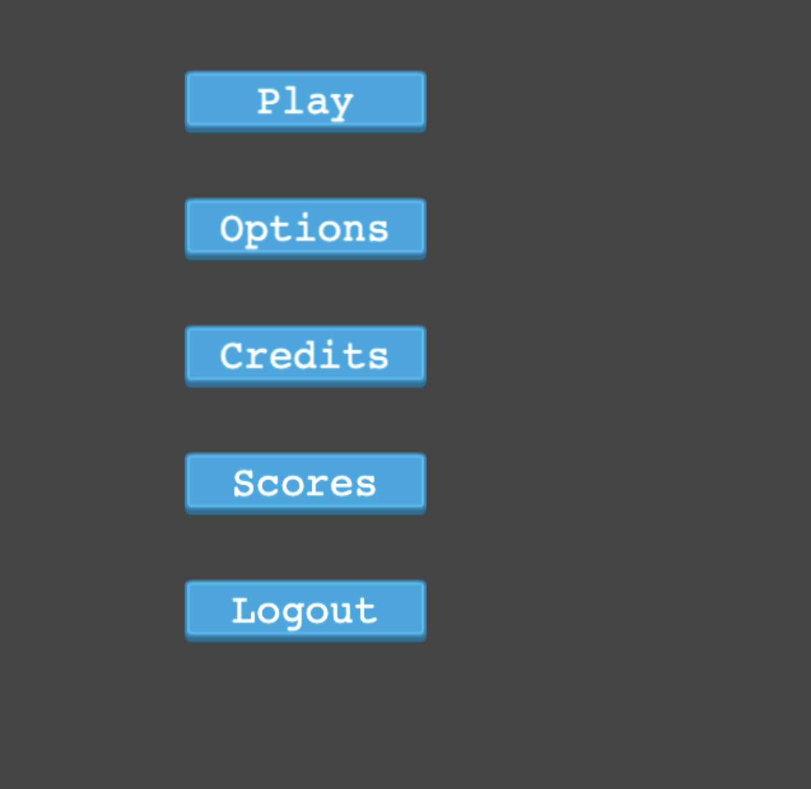
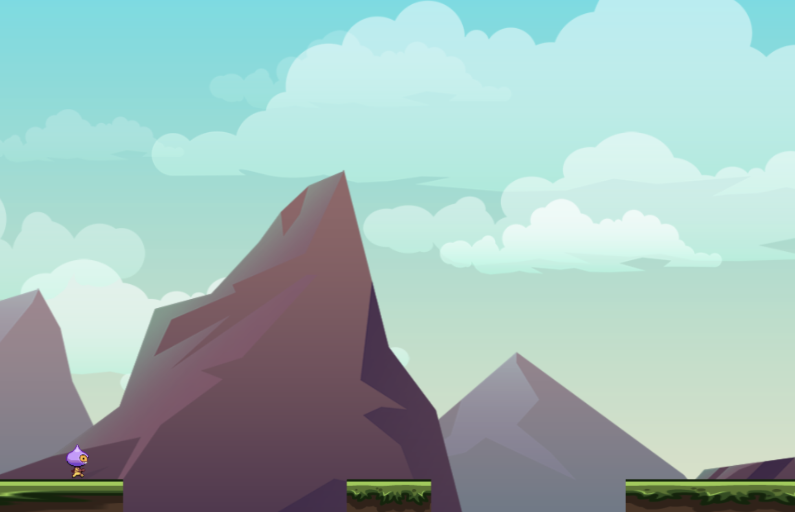
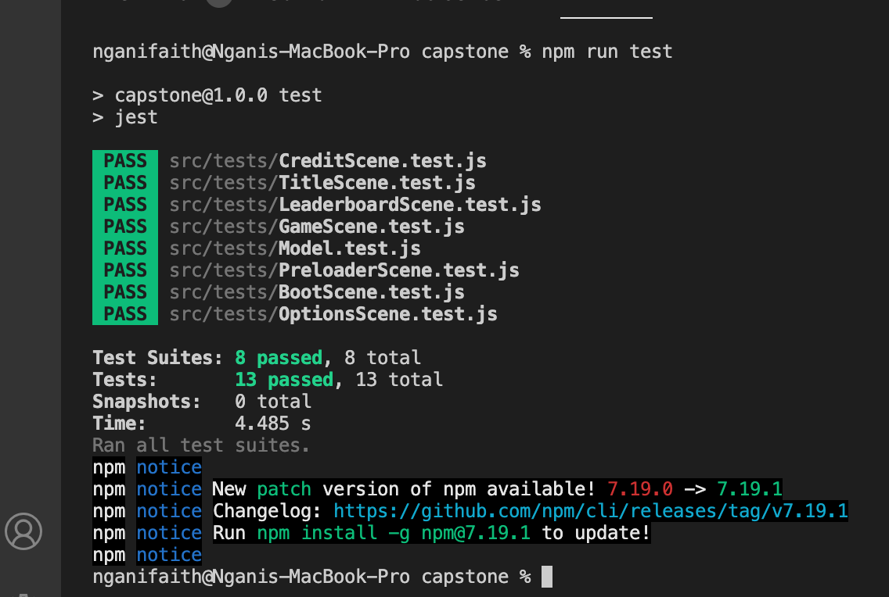

# Runner Game

## App

## About

This game implements a simple endless runner game whereby a runner score increases with time (after every 300ms). The game displays the user current score, High score and the user name on the game.

## Play Game

Simple play game by using your mouse pad. Click to jump and run as far as you can go on the ground without falling off.

## Game Design Document

Full details of the Game can be found here [GDD](./GDD.md)

## Built With

- Javascript
- Bootstrap 5
- Html
- Webpack
- Phaser 3

### Prerequisites

Knowledge about JS:

- Basic data structures
- Arrays
- Functions
- Constructors
- Knownledge of webpack
- Knownledge of Phaser 3

## Clone project

- To get a local copy up and running follow these simple example steps.
- Clone this repository with `https://github.com/nganifaith/JS_Capstone-RPG-Phaser.git` using your terminal or command line.
- Change to the project directory by entering: cd JS_Capstone-RPG-Phaser in the terminal.

## Command line steps

- $ git clone `$ https://github.com/nganifaith/JS_Capstone-RPG-Phaser.git`
- $ `cd JS_Capstone-RPG-Phaser `
- $ `git checkout feature`

## Start App

- run `npm install`
- run `npm start` in your command line

## Test

- run `npm run test` to run test
  

## Live Site

[Link](https://unruffled-euler-e01838.netlify.app/)

## Author

👤 **Ngani Faith**

- GitHub: [@nganifaith](https://github.com/nganifaith)
- Twitter: [@Bright_Ngani](https://twitter.com/bright_ngani)
- LinkedIn: [Ngani Faith](https://www.linkedin.com/in/ngani-faith/)

## 🤝 Contributing

Contributions, issues, and feature requests are welcome!

Feel free to check the [issues page](https://github.com/nganifaith/JS_Capstone-RPG-Phaser/issues).

## Show your support

Give a ⭐️ if you like this project!

## 📝 License

This project is [MIT](./LICENSE) licensed.
